# 🏦 Apex Bank — Desktop Banking Management System

> A full-featured, role-based banking management application built with **C# Windows Forms** and **SQL Server**, implementing a clean 3-layer architecture with real-time validation, transactional integrity, and a comprehensive audit trail.

---

## 📸 Screenshots

### 🔑 Authentication & Profile
| Login Page | Registration Page | My Profile |
| :---: | :---: | :---: |
| 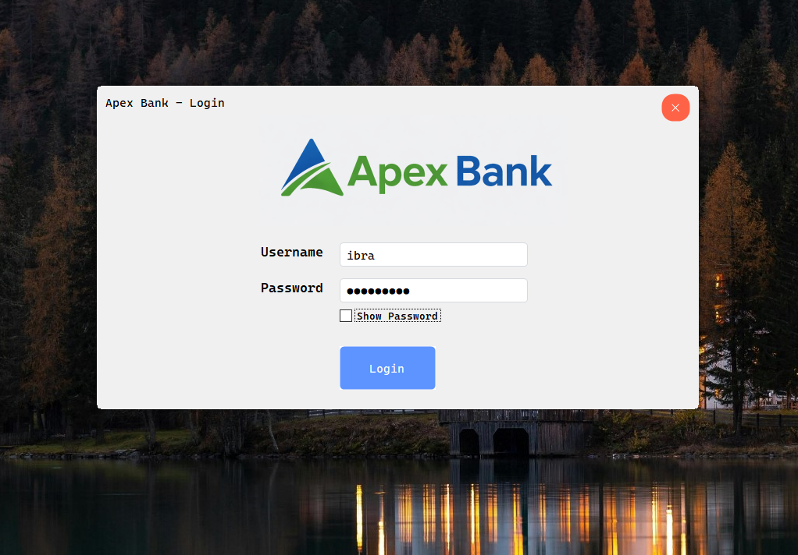 | 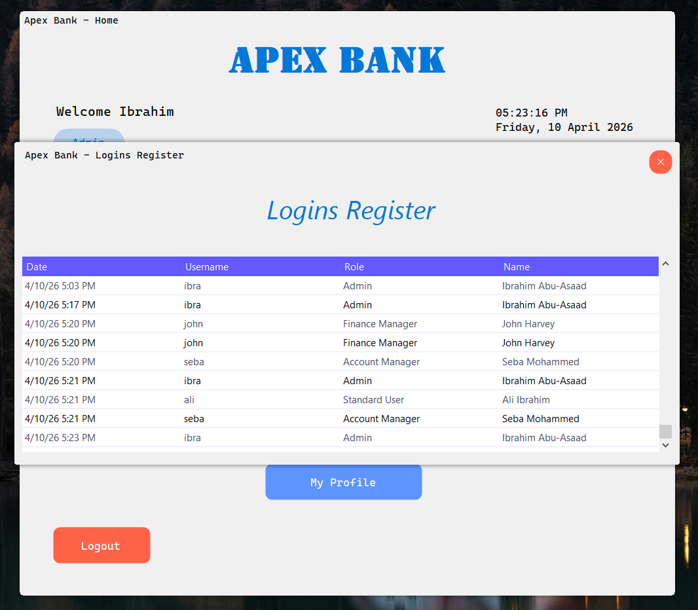 | 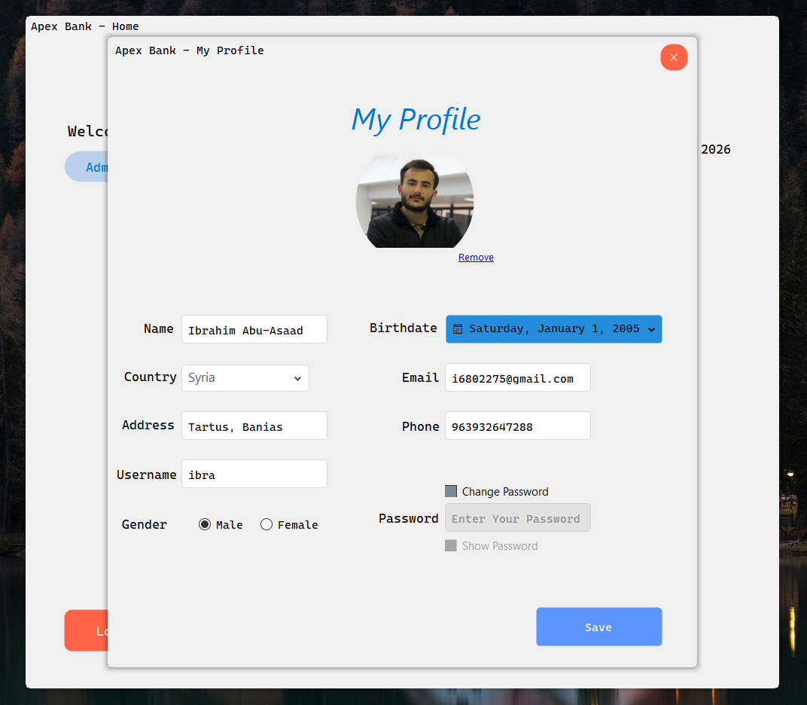 |

### 👥 User & Client Management
| Manage Users | Edit User | Roles & Permissions |
| :---: | :---: | :---: |
| 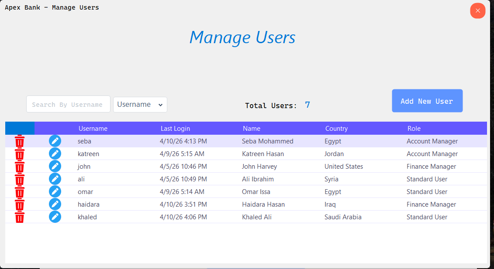 | 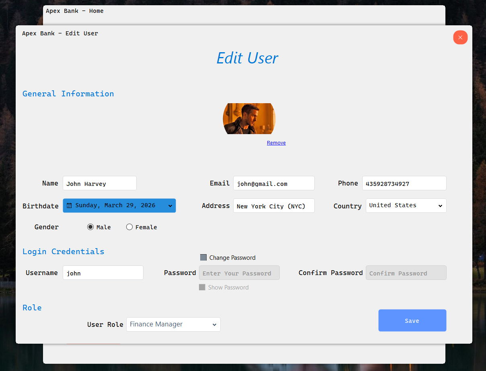 | 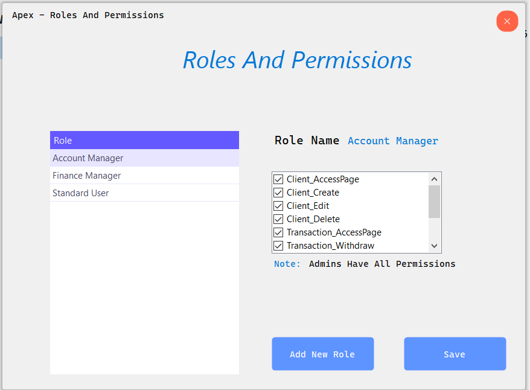 |

| Manage Clients | Add New Client |
| :---: | :---: |
| 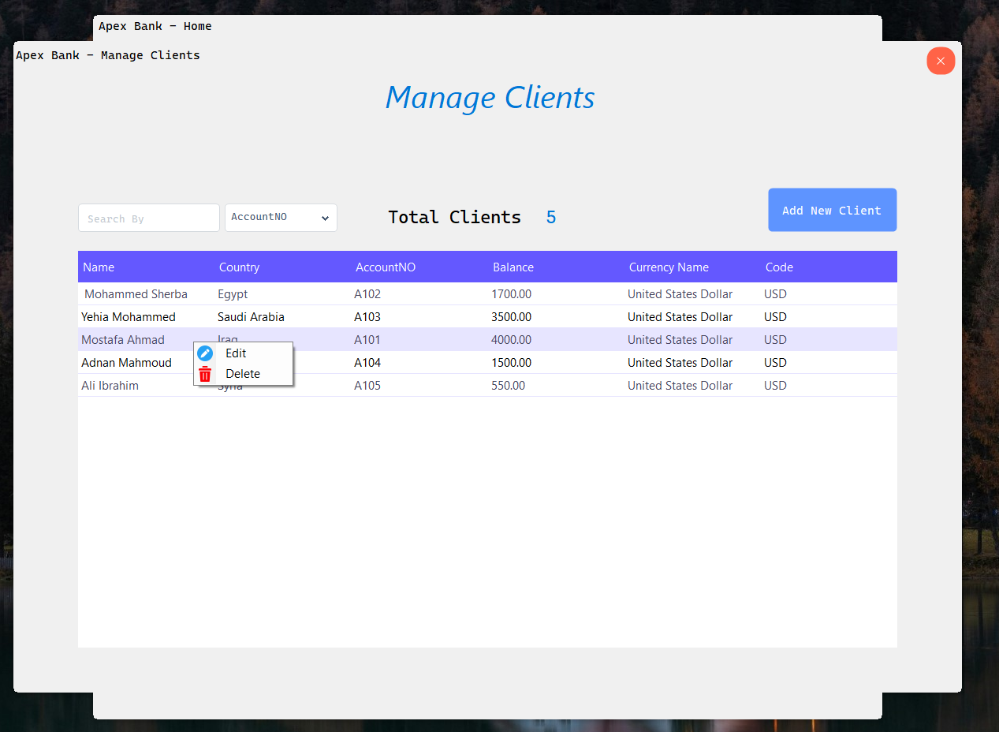 | 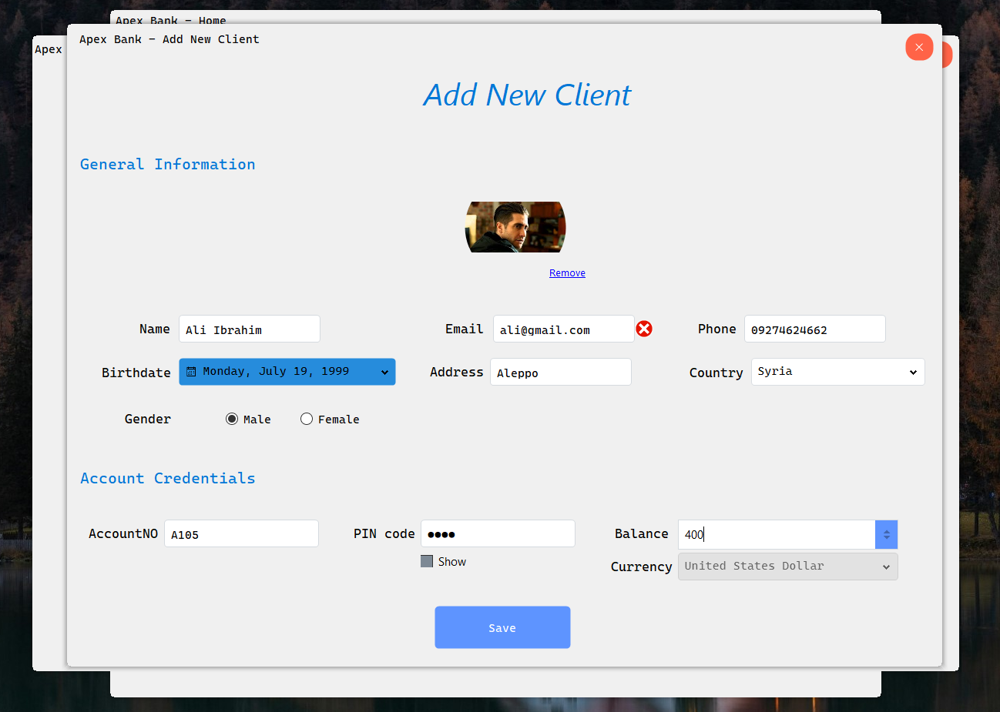 |

### 💰 Banking Operations
| Bank Interface | Currencies Rates | Transactions Register |
| :---: | :---: | :---: |
| 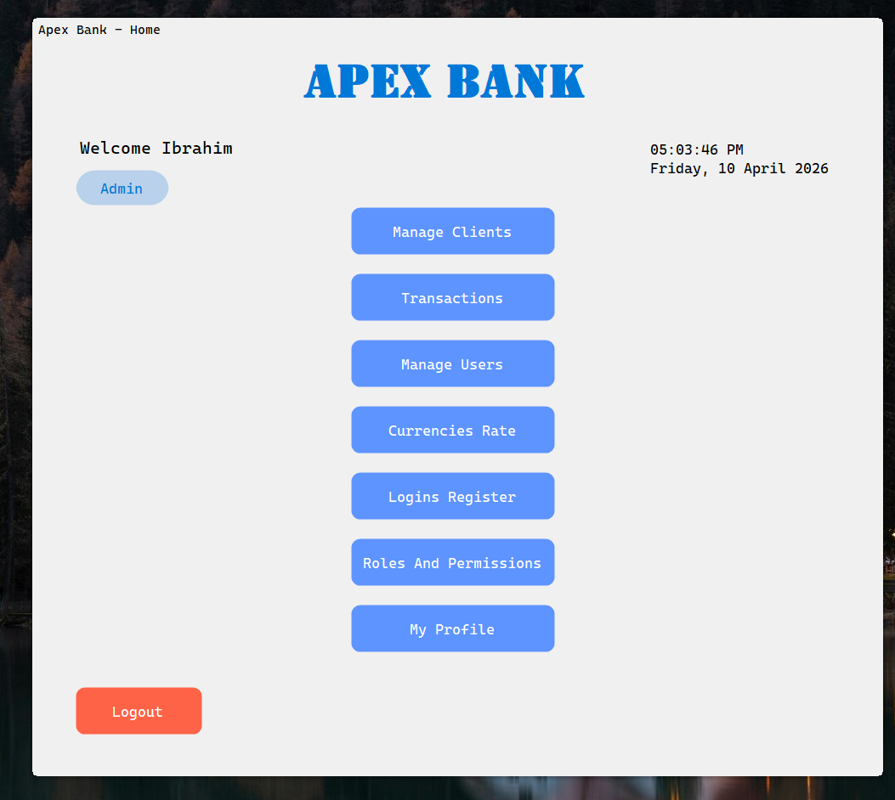 | 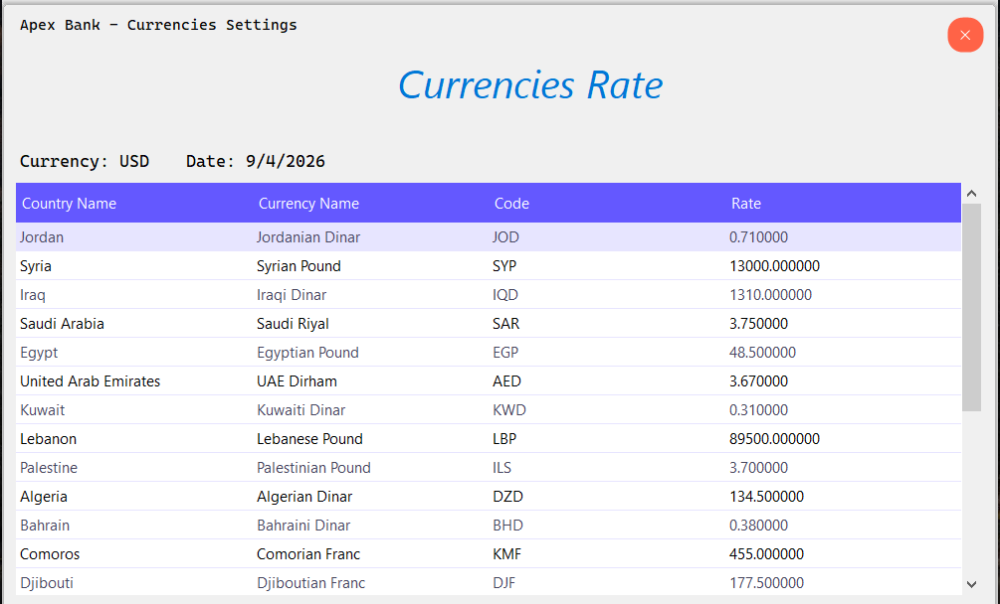 | 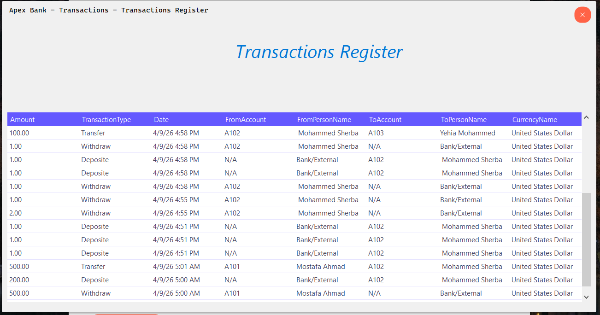 |

| Deposit | Withdraw | Transfer |
| :---: | :---: | :---: |
| 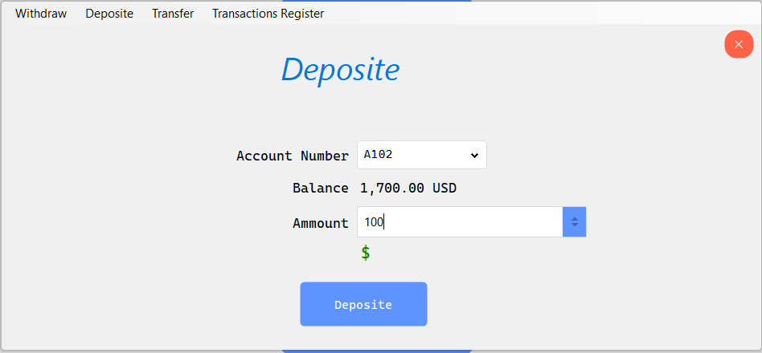 | 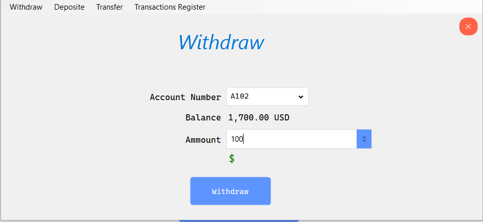 | 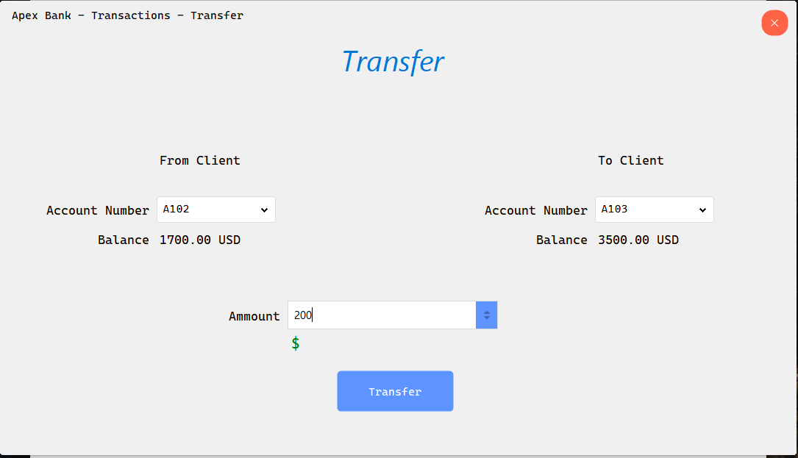 |

---

## 🔍 Overview

**Apex Bank** is a desktop banking system designed to simulate real-world bank operations. It supports multi-user access with granular role-based permissions, enabling Admins, Account Managers, Finance Managers, and Standard Users to interact with the system based on their authorization level.

The application handles client account management, monetary transactions (deposit, withdrawal, transfer), currency exchange rate tracking, and a full audit log of all system activity.

The system implements secure authentication using industry-standard password hashing (BCrypt) and basic brute-force protection mechanisms.

---

## 🏛️ Architecture

The project is built on a **3-Layer (N-Tier) Architecture**, strictly separating concerns:

```
┌─────────────────────────────────┐
│     Presentation Layer (UI)     │  Windows Forms — all screens & dialogs
├─────────────────────────────────┤
│   Business Logic Layer (BLL)    │  business rules, and entity logic
├─────────────────────────────────┤
│   Data Access Layer (DAL)       │  SQL Server queries via stored procedures
└─────────────────────────────────┘
```

**Key design principles applied:**
- **Separation of Concerns** — each layer has a single, well-defined responsibility
- **Modularity** — features (clients, users, transactions) are independently structured
- **OOP** — classes represent real-world entities with clear state and behavior

---

## ✨ Features

### 👤 User & Access Management
- Secure login system with show/hide password toggle
- Role-Based Access Control (RBAC) with fully configurable permissions per role
- Admin can add, edit, and delete(Soft deletion) users with assigned roles
- Profile management for all logged-in users
- Search and filter users by Username or Name

### 🏧 Client Account Management
- Full CRUD for bank clients (Create, Read, Update, Delete(Soft deletion))
- Each client has a unique Account Number, PIN code, balance, and currency
- Profile photo support with set/remove functionality
- Search and filter clients by Account Number or Name

> [!NOTE]
> **Secure Data Handling:** Implementing "Soft Delete" logic for Users and Clients;
> records are marked as 'Deleted' (0 to 1) instead of being permanently removed to maintain database integrity and audit history.
  

### 💸 Transactions
- **Deposit** — add funds to any client account
- **Withdraw** — deduct funds with balance sufficiency validation
- **Transfer** — move funds between two accounts in real time
- Dollar sign ($) indicator with live balance display
- Full transaction history in the **Transactions Register**

### 💱 Currencies Rate
- Displays exchange rates for Middle Eastern currencies
- Base currency: USD, with rates for JOD, SYP, IQD, SAR, EGP, AED, KWD, LBP, and more

### 📋 Audit & Logging
- **Logins Register** — records every login event with timestamp, username, role, and full name
- **Transactions Register** — complete ledger with transaction type, amount, date, from/to accounts and person names, and currency

### 🔐 Roles & Permissions
- Configurable roles: Admin, Account Manager, Finance Manager, Standard User
- Granular permissions: `Client_AccessPage`, `Client_Create`, `Client_Edit`, `Client_Delete`, `Transaction_AccessPage`, `Transaction_Withdraw`, and more
- Admins automatically inherit all permissions
- Ability to add new custom roles at runtime

### ✅ Input Validation
- Real-time **ErrorProvider** validation on all input fields
- Validates: name, email format, phone number, address, date of birth, account number uniqueness, PIN strength, and password confirmation match
- Prevents saving until all required fields pass validation — no silent failures

---

## 🛠️ Tech Stack

| Layer | Technology |
|-------|-----------|
| Language | C# (.NET Framework) |
| UI Framework | Windows Forms (WinForms) |
| Libraries | Guna.UI2 |
| Database | Microsoft SQL Server |
| Data Access | ADO.NET with Stored Procedures |
| IDE | Visual Studio |
| Architecture | 3-Layer (Presentation / BLL / DAL) |

---

## 🗄️ Database Design

The SQL Server database uses a normalized relational schema with the following core tables:

```
Persons          → Stores client/User personal info.
Clients          → Stores client Sensitive Info: account number, PIN, balance.
Users            → Stores system users with login credentials and roles.
Roles            → Defines available roles (Admin, Account Manager, Finance Manager).
Permissions      → Maps permissions to roles.
Countries        → Store Arab Countries and USA.
Transactions     → Logs every financial transaction with from/to accounts.
LoginsRegister   → Audit log of all login events.
Currencies       → Currency name, code and  Country.
Exchange Rates   → Stores real-time currency conversion values used for calculating international bank transfers.
RolePermissions  → Manages granular access control by mapping specific system permissions to authorized user roles.
```

**Key constraints enforced at the DB level:**
- Unique Account Numbers per client
- Unique Username per user
- Non-nullable fields for critical financial data

---

## 📦 Modules

| Module | Description |
|--------|-------------|
| **Login** | Authenticates users using hashed passwords (BCrypt), tracks login attempts, and records login timestamps |
| **Dashboard** | Role-aware home screen; shows only permitted navigation items |
| **Manage Clients** | Full client CRUD with search, pagination, and photo management |
| **Add / Edit Client** | Form with real-time validation, date picker, country dropdown |
| **Transactions** | Tabbed interface: Withdraw / Deposit / Transfer / Transactions Register |
| **Manage Users** | Admin-only user management with role assignment |
| **Add / Edit User** | User form with login credentials and role selector |
| **Currencies Rate** | Live currency rate table |
| **Logins Register** | login audit log with date, username, role, name |
| **Transactions Register** | Full transaction ledger with type, accounts, amounts |
| **Roles & Permissions** | Permission matrix editor per role with save and add-new |
| **My Profile** | Editable personal profile for the currently logged-in user |

---

## 🔐 Security

- **Password hashing (BCrypt)** — all user passwords are securely hashed using BCrypt before being stored in the database
- **Login attempt protection** — limits login attempts and enforces a temporary lockout after repeated failures to mitigate brute-force attacks
- **Session binding** — all actions are tied to the authenticated user's identity
- **Permission enforcement** — every sensitive screen checks the user's permission before rendering
- **Audit trail** — logins and all financial activity are permanently logged and cannot be deleted from the UI
- **Balance validation** — withdrawals and transfers are rejected server-side if balance is insufficient

---

## 🚀 Getting Started

### Prerequisites

- Visual Studio 2019 or later
- SQL Server 2017 or later (or SQL Server Express)
- .NET Framework 4.7.2+

### Setup

1. **Clone the repository**
   ```bash
   git clone https://github.com/Ibrahim-Abu-Asaad/BankSystem.git
   cd BankSystem
   ```

2. **Download the SQL Script:**
   Choose the script that matches your SQL Server version:
   - **SQL Server 2019:** [Download Script](https://drive.google.com/file/d/1lQHYK10YgP814DAwyLCgRYMKiDKUvGpo/view?usp=sharing)
   - **SQL Server 2022:** [Download Script](https://drive.google.com/file/d/1wPSK55GORvMs4eA_JVznnjQwJ2v1tcRI/view?usp=sharing)

3. **Prepare the Database:**
   - Open **SQL Server Management Studio (SSMS)** and connect to your instance.
   - Right-click on **Databases** and select **New Database...**
   - Name the database: `BankSystemDB`

4. **Execute the Script:**
   - Open the downloaded `.sql` file in SSMS (File > Open > File).
   - Ensure `BankSystemDB` is selected in the available databases dropdown (top left).
   - Press **Execute** (or `F5`) to run the script and build your system.

5. **Configure the connection string**
   - Open `BankSystemDAL/clsDataAccessSettings.cs`
   - Update the `Server` and `Database` fields to match your SQL Server instance:
     ```csharp
     public static string ConnectionString = "Server=YOUR_SERVER_NAME; Database=BankSystemDB; Integrated Security=True;";
     ```
     OR
     ```csharp
      public const string ConnectionString = "Server=YOUR_SERVER_NAME; Database=BankSystemDB; User ID=YOUR_USER; Password=YOUR_PASSWORD;";
     ```

6. **Build and Run**
   - Open `BankSystem.sln` in Visual Studio
   - Press `F5` or click **Start** to build and run

7. **Default Admin Login**
   ```
   Username: ibra
   Password: 123123123
   ```

---

## 🗂️ Project Structure

```
BankSystem/ (Solution)
│
├── BankSystemUI/               # Presentation Layer (Organized by Feature)
│   ├── 📂 Auth                 # frmLogin.cs
│   ├── 📂 Clients              # frmManageClients.cs, frmAddEditClients.cs
│   ├── 📂 Currencies           # frmCurrenciesSettings.cs
│   ├── 📂 Logs                 # frmLoginsRegister.cs
│   ├── 📂 Main                 # frmBankSystem.cs, frmMyProfile.cs
│   ├── 📂 Roles & Permissions  # frmRolesAndPermissions.cs, frmAddNewRole.cs
│   ├── 📂 Transactions         # frmTransactions.cs, frmTransfer.cs, frmTransactionsRegister.cs
│   ├── 📂 Users                # frmManageUsers.cs, frmAddEditUsers.cs
│   ├── 📂 Resources            # Icons and Images (Edit, Trash, Profile, etc.)
│   └── Program.cs              # Application Entry Point
│
├── BankSystemBLL/              # Business Logic Layer (The "Brain")
│   ├── clsPerson.cs            # Base Class for People
│   ├── clsClient.cs            # Client Logic
│   ├── clsUser.cs              # User Logic & Authentication
│   ├── clsRole.cs              # Role Logic
│   ├── clsPermission.cs        # Permissions Logic
│   ├── clsPermissionItem.cs    # Easy Handling With Permissions
│   ├── clsTransactions.cs      # Transaction Operations Logic
│   ├── clsCurrency.cs          # Currency Logic
│   └── clsCountry.cs           # Country Functions
│
└── BankSystemDAL/              # Data Access Layer (SQL Communication)
    ├── clsDataAccessSettings.cs# Database Connection Settings
    ├── clsDataClient.cs        # Client DB Queries
    ├── clsDataUser.cs          # User DB Queries
    ├── clsDataRole.cs          # Role DB Queries
    ├── clsDataPermission.cs    # Permission DB Queries
    ├── clsDataTransaction.cs   # Transaction DB Queries
    ├── clsDataCurrency.cs      # Currency DB Queries
    └── clsDataCountry.cs       # Country DB Queries
```

---

## 👨‍💻 Author

**Ibrahim Abu-Asaad**

- Built as a practice project to master programming foundations and the core principles of Object-Oriented Programming (OOP).
- Developed to gain a deep understanding of 3-Tier Architecture, ensuring a clean separation between User Interface, Business Logic,and Data Access.
- Covers security, financial integrity, UI/UX, database design, and clean architecture in a single cohesive project.

---

## 📄 License

This project is open-source and free for everyone, feel free to fork it.
---
